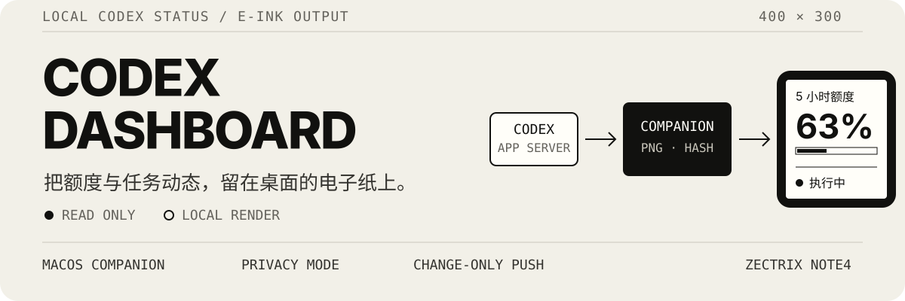
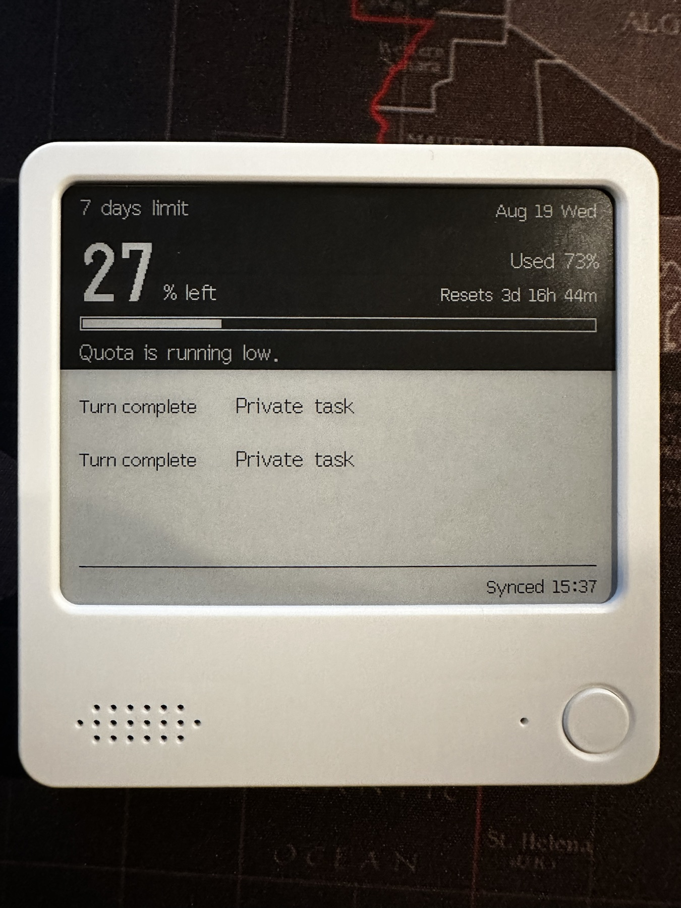
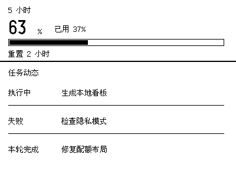

# eink-codexBar

English | [简体中文](./README.zh-CN.md)

<p align="center">
  
</p>

Put your Codex quota, reset time, and recent task activity on a quiet, always-on ZECTRIX NOTE4. The macOS companion reads state locally, renders a 400×300 monochrome image, and pushes only when visible content changes.

## On-device view

<p align="center">
  
</p>

This is the dashboard running on a ZECTRIX NOTE4. The companion rendered the frame from Codex state and pushed it to the device.

### Raw dashboard output

<p align="center">
  
</p>

This 400×300 image comes directly from the repository's fixed fixture. It is not a design mockup.

- Remaining Codex quota, usage, window duration, and reset time
- Up to three recent task states: `Running`, `Task completed`, `Failed`, or `Interrupted`
- Last-known state retained and marked stale when a data source is temporarily unavailable
- Privacy mode that hides task titles while keeping task states and counts
- Chinese and English dashboard labels; task titles stay in their original language

## How it works

1. The companion sends the read-only `account/rateLimits/read` request through the official standalone `codex app-server`.
2. Codex hooks provide execution events, and read-only task metadata matches those events to top-level task titles.
3. The Mac normalizes the state and renders a 400×300 PNG for the NOTE4.
4. The companion uploads to the selected ZECTRIX page only when the visible frame changes and the push interval allows it.

The NOTE4 refresh interval controls how often the device checks the cloud for a new image. It does not make the companion upload at the same interval. The dashboard uploads only when visible information such as quota, tasks, or date changes. The on-screen “Synced” time therefore shows the latest successful upload, not every device refresh.

The companion handles quota percentages, windows, reset data, task titles, and a limited set of task activity states. It does not save or display prompts, responses, reasoning, tool arguments, plan text, or project paths.

## Install

You need macOS, Codex, and a ZECTRIX NOTE4. The packaged plugin includes the companion binary, so installation does not require Python, Node.js, or Rust.

### Create a ZECTRIX API key

1. Sign in to [ZECTRIX Cloud](https://cloud.zectrix.com).
2. Open the API section and create an API key.
3. Store the key securely. Treat it like a password, and do not paste it into chat or commit it to the repository.

See the [official ZECTRIX API documentation](https://wiki.zectrix.com/zh/software/api-docs) for the full API. During setup, the companion reads the API key locally, lists compatible NOTE4 devices, and asks you to choose a persistent page, privacy setting, and dashboard language. You do not need to enter a device MAC address or edit a configuration file.

```sh
codex plugin marketplace add BarryBarrywu/codex-zectrix-dashboard
codex plugin add codex-zectrix-dashboard@codex-zectrix-dashboard
```

After installation, run this in Codex:

```text
$setup-zectrix-dashboard
```

Setup collects the ZECTRIX API key in a local non-echoing terminal prompt and stores it in macOS Keychain. It shows a preview and explains the upload boundary before the first push. Nothing is sent to the device until you confirm.

### Update

Run `$setup-zectrix-dashboard` again and follow the guarded update flow. The update requires reloading or restarting Codex. Do not delete the old plugin cache or run `codex plugin marketplace upgrade` before starting the guarded update.

## Try it without a device

Generate a fixed English preview from the repository:

```sh
cargo run --locked --release -- preview \
  --input fixtures/sample-dashboard.json \
  --output preview.png \
  --language en
```

Read the current Codex quota and generate a live English preview:

```sh
cargo run --locked --release -- live-preview \
  --output live-preview.png \
  --language en
```

`live-preview` does not connect to Codex Desktop or a ZECTRIX device. Running from source requires Rust; installing the packaged plugin does not.

## Privacy boundary

By default, the dashboard includes task titles, and the rendered PNG is uploaded to ZECTRIX Cloud. Privacy mode replaces titles with “Private task,” while quota, task states, and counts remain visible.

The API key is stored in macOS Keychain. Diagnostics report only data-source status. They do not print account details, device IDs, prompts, responses, or other raw content.

## Current limitations

- Supports only macOS and ZECTRIX NOTE4
- Does not mirror the unread blue dot from Codex Desktop
- Does not provide authoritative “waiting for you,” “checking,” or plan-progress states
- Cannot modify, control, or stop Codex tasks
- Passing fixture and fake-ZECTRIX tests does not constitute physical NOTE4 validation

## Validate

```sh
cargo test --locked --all-features
./scripts/build-release.sh
./scripts/test-clean-install.sh
```

Report automated tests, release-package validation, and physical NOTE4 validation separately. Device selection, persistent `pageId`, the first push, later updates, and physical readability still require a separately authorized device check.

## License

[MIT](./LICENSE)
